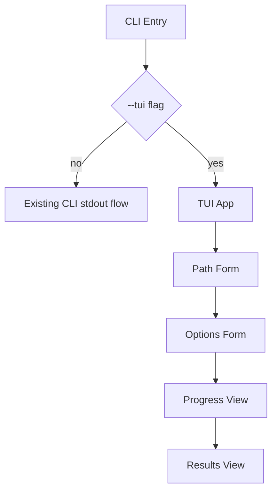

# TUI Plan (Ink)

## Goals
- Add a `--tui` entrypoint for interactive scan configuration and results viewing.
- Keep existing CLI behavior unchanged when `--tui` is not provided.
- Provide a full-screen Ink TUI with scan progress and severity-filtered results.

## Proposed UX Flow
1. **Start Screen**: path input (file/dir), recent path shortcut (optional), and mode (file/dir) auto-detected after validation.
2. **Options Form**: set severity threshold, checks list, ignore globs, provider/model, web search, fix, report, sarif.
3. **Run & Progress**: show status (scanning file/dir), counts as they stream (if possible), and elapsed time.
4. **Results**: summary panel, severity filter tabs, findings list, and detail pane for selected item.

## CLI Integration
- Extend argument parsing in [src/cli.ts](../src/cli.ts:219) to include `--tui`.
- When `--tui` is present, bypass stdout formatting and launch Ink renderer.

## UI State Model
- `path`: string
- `options`: ScanOptions
- `phase`: `setup | running | results | error`
- `progress`: `currentFile?`, `scannedCount?`, `elapsed` (best-effort)
- `result`: `ScanResult | { findings: SecurityFinding[] }`
- `filterSeverity`: `low | medium | high | critical | all`
- `selectedFindingIndex`: number

## Data/Type Mapping
- Use existing `scanFile()` and `scanDirectory()` in [src/scanner.ts](../src/scanner.ts:1).
- Map form values into `ScanOptions` as used in [src/cli.ts](../src/cli.ts:219).
- For file scans, wrap findings into a `ScanResult`-like object for unified results view.

## TUI Modules
- `src/tui/index.ts` (Ink render entrypoint)
- `src/tui/App.tsx` (state + routing between screens)
- `src/tui/components/PathForm.tsx`
- `src/tui/components/OptionsForm.tsx`
- `src/tui/components/ProgressView.tsx`
- `src/tui/components/ResultsView.tsx`
- `src/tui/components/FindingDetail.tsx`
- Optional shared formatter(s): `src/tui/utils/format.ts`

## Build/Deps Updates
- Add dependencies: `ink`, `react`, `@types/react`.
- Add dev dependency if needed: `@types/node` already present.
- Update TS config to support TSX for `src/tui/*.tsx`.
- Ensure build output includes TUI entry via existing `tsc` build.

## README/CHANGELOG Updates
- Document `--tui` usage under CLI options with a short example.
- Add a brief note about interactive flow and available screens.
- Update [CHANGELOG.md](../CHANGELOG.md) with the new TUI feature.

## Mermaid Flow

